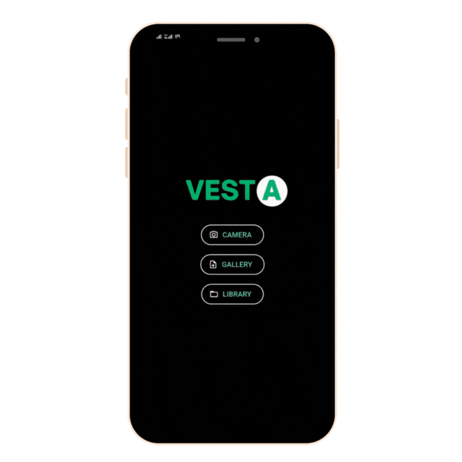

# Meat-AI - Meat Freshness Classification Using AI
 *Built with Microsoft Custom Vision & Flutter*
 
 This project leverages AI and computer vision to classify the freshness of meat (Beef) based on color features.



 
 Key Features:
 
 AI-Powered Freshness Detection: Classifies  meat freshness into categories (e.g., Fresh, Moderately Fresh, Spoiled) using image color characteristics.
 Cross-Platform Mobile App: Built with Flutter for both Android and iOS, offering real-time, user-friendly inspections.
 Offline Model Deployment: Uses TensorFlow Lite for on-device inference, even in low-connectivity environments.
 Easy to Train & Extend: New categories or meat types can be added easily with Microsoft Custom Vision’s intuitive interface.
 
 Why This Project?
 Manual inspection of meat freshness can be subjective, inconsistent, and prone to error. This AI solution brings:
 
 1. Consistency in meat quality assessment
 2. Better consumer protection
 3. Reduced health risks from spoiled meat
 4. Less food waste and more efficient quality control
 
Tech Stack
 
 Microsoft Custom Vision (Image Classification) - Link: https://www.customvision.ai/ ,
 Flutter (Mobile UI),
 TensorFlow Lite (Offline Model Deployment),
 C++


 **Learn about Microsoft Custom Vision : https://learn.microsoft.com/en-us/azure/ai-services/custom-vision-service/**


## Try Your own model with Microsoft Azure Custom Vision

## Prerequisites

Before you begin, ensure you have the following installed and set up:

* **Flutter SDK:** [Install Flutter](https://docs.flutter.dev/get-started/install)
* **Azure Account:** A Microsoft Azure subscription is required to use Custom Vision. You can [create a free account](https://azure.microsoft.com/free/).
* **IDE:** An IDE like Visual Studio Code or Android Studio with Flutter plugins installed.
* **Image Dataset:** A collection of images to train your classification model.

## Step 1: Create and Train Your Image Classification Model with Azure Custom Vision

1.  **Go to Custom Vision Portal:** Navigate to the [Custom Vision web page](https://www.customvision.ai/) and sign in with your Azure account.
2.  **Create New Project:**
    * Click **New Project**.
    * **Name & Description:** Give your project a relevant name and description.
    * **Resource:** Select an existing Custom Vision Training Resource or create a new one.
    * **Project Types:** Select **Classification**.
    * **Classification Types:** Choose **Multiclass (single tag per image)**. (Or Multilabel if your use case requires multiple tags per image).
    * **Domains:** Select a **Compact** domain. This is crucial for exporting to TFLite. Options include **General (compact)**, Food (compact), etc..
    * Click **Create project**.
3.  **Upload & Tag Images:**
    * Click **Add images**.
    * Upload images in groups based on the classification tag you want to assign. A minimum of 5 images per tag is recommended for basic training, but more diverse images (varying angles, lighting, backgrounds) lead to better results.
    * Create or select tags for each group of images.
    * Click **Upload [number] files**. Repeat for all your classes/tags.
4.  **Train the Model:**
    * Once images are uploaded and tagged, click the **Train** button.
    * Choose a training budget (Quick Training is suitable for initial tests).
    * Wait for the training to complete.

## Step 2: Export the Model as TensorFlow Lite (.tflite)

1.  **Go to Performance Tab:** After training, navigate to the **Performance** tab in your Custom Vision project.
2.  **Select Iteration:** Choose the iteration you want to export (usually the latest one).
3.  **Export Model:** Click the **Export** button.
4.  **Choose Platform:** Select **TensorFlow**.
5.  **Choose Flavor/Format:** Select **TensorFlowLite** from the dropdown.
6.  **Download:** Click **Export**, then **Download**. This will download a `.zip` file.
7.  **Extract Files:** Unzip the downloaded file. Inside, you should find essential files including:
    * `model.tflite`: Your trained TensorFlow Lite model.
    * `labels.txt`: A text file listing your classification tags, one per line.

## Step 3: Integrate the TFLite Model into the Vesta App

1.  **Replace Model Files:**
    * Navigate to the `vesta/assets/model/` directory within your Flutter project structure.
    * **Delete** the existing `model.tflite` and `labels.txt` files.
    * **Copy** your newly downloaded and extracted `model.tflite` and `labels.txt` files into this `vesta/assets/model/` directory.
2.  **Verify `pubspec.yaml`:**
    * Open the `vesta/pubspec.yaml` file.
    * Confirm that the `tflite_flutter` dependency is listed (it should be present as `^0.11.0`).
    * Confirm that the `assets/model/` directory and its contents are declared under the `flutter:` -> `assets:` section (they should be listed as `assets/model/model.tflite` and `assets/model/labels.txt`). No changes are likely needed here if you just replaced the files.
    ```yaml
    dependencies:
      flutter:
        sdk: flutter
      # ... other dependencies
      tflite_flutter: ^0.11.0 # Ensure this or a compatible version is present

    flutter:
      uses-material-design: true
      assets:
        - assets/model/model.tflite # Ensure this line exists
        - assets/model/labels.txt  # Ensure this line exists
        - assets/images/
        - assets/animation/
    ```
3.  **Check Code Adjustments (If Necessary):**
    * Open the `vesta/lib/utils/detector_services.dart` file.
    * **Input Size:** Find the `mlModelInputSize` constant within the `_DetectorServer` class. The current value is `224`. Verify if your exported Custom Vision model expects this input size (common for compact domains). If your model requires a different input size (e.g., 300x300), update this constant accordingly.
        ```dart
        class _DetectorServer {
          static const int mlModelInputSize = 224; // <-- Check/Update this value
          // ... rest of the class
        }
        ```
    * **Output Shape/Number of Labels:** Locate the `_runInference` function in the `_DetectorServer` class. Find the `output` map definition. The current code initializes the output buffer assuming 3 labels (`List<num>.filled(3, 0)`). Count the number of lines (labels) in **your** `labels.txt` file and update the number `3` in `List<num>.filled(3, 0)` to match your label count.
        ```dart
          List<List<Object>> _runInference(
            List<List<List<num>>> imageMatrix,
          ) {
            final input = [imageMatrix];

            // Update the '3' here to match the number of labels in your labels.txt
            final output = {
              0: [List<num>.filled(YOUR_LABEL_COUNT, 0)], // <-- Update this number
            };
            _interpreter!.runForMultipleInputs([input], output);
            return output.values.toList();
          }
        ```
    * **Preprocessing:** The current code resizes the image. Custom Vision models usually handle necessary normalization internally, but review the `analyseImage` function if you suspect specific preprocessing (beyond resizing) is needed for your model.

## Step 4: Run the App

1.  **Get Dependencies:** Open a terminal in the `vesta` project root directory and run:
    ```bash
    flutter pub get
    ```
2.  **Run:** Connect a device or start an emulator/simulator and run:
    ```bash
    flutter run
    ```

The app should now load your custom TensorFlow Lite model and use it for image classification when you use the Camera or Gallery features.
